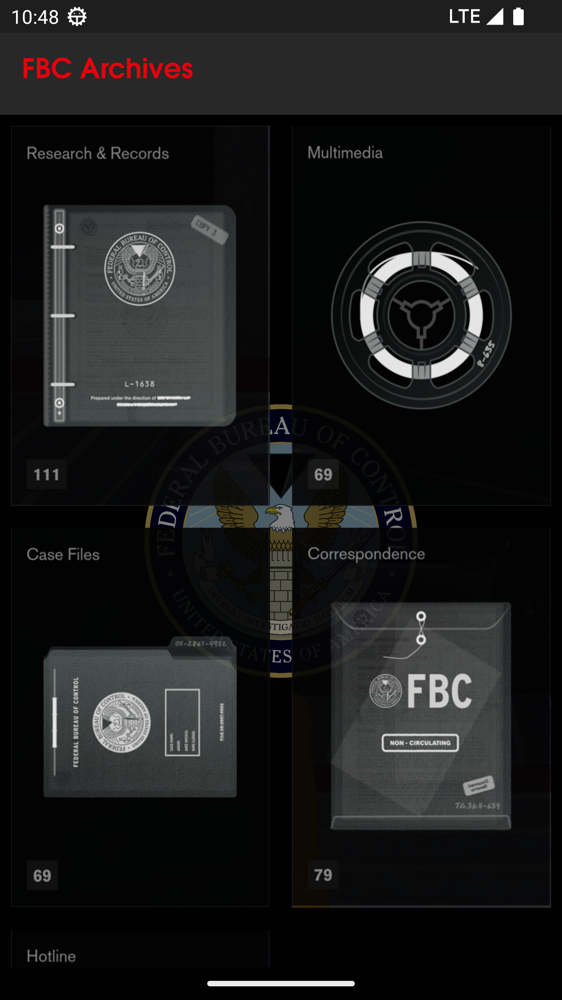
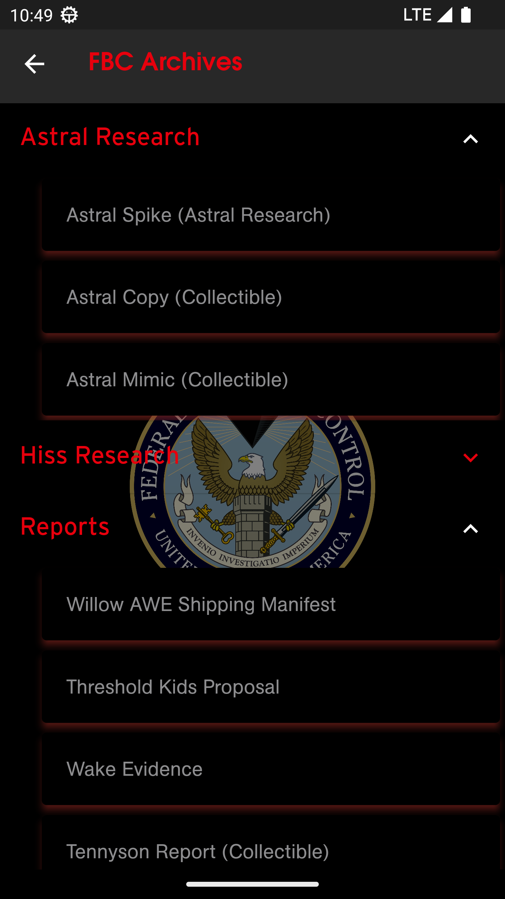
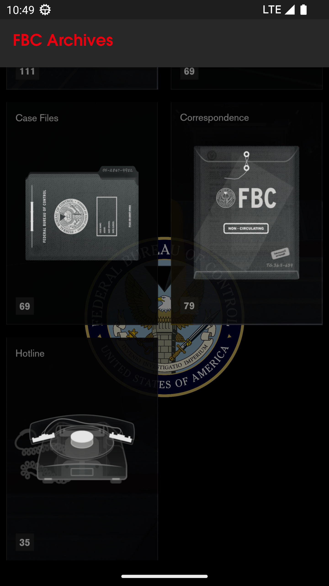
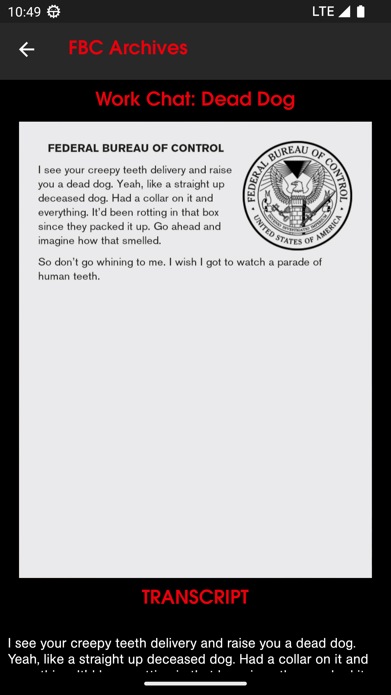

[Github Link](https://github.com/Kshitijpawar/Control_collectibles_app)

# Mobile App to view collectibles from 2019 video game [Control](https://en.wikipedia.org/wiki/Control_(video_game)) by Remedy Entertainment.

## Data scraped using Python Scrapy library and stored in Firebase Realtime database. Flutter frontend for mobile application

## Folder structure

- controlscrape: Scrapy code
- control_lore: Flutter application 

## Setup for mobile app 
Prerequistes - Flutter SDK. [How to Install](https://docs.flutter.dev/get-started/install)   
Clone the offline_json branch and cd into control_lore folder to run the following commands.  
    
    flutter pub get 
    flutter run

## To Do
- Scrape multimedia youtube links and add to mobile app as url redirect button
- ~~Add local json load and parsing instead of firebase dependency.~~
- QA System hosted on server(Provided I get resources to host the models lol)
## Images
  
  
 &nbsp;&nbsp;&nbsp;&nbsp;&nbsp;&nbsp;
 &nbsp;&nbsp;&nbsp;&nbsp;&nbsp;&nbsp;
 &nbsp;&nbsp;&nbsp;&nbsp;&nbsp;&nbsp;
 &nbsp;&nbsp;&nbsp;&nbsp;&nbsp;&nbsp;
 &nbsp;&nbsp;&nbsp;&nbsp;&nbsp;&nbsp;