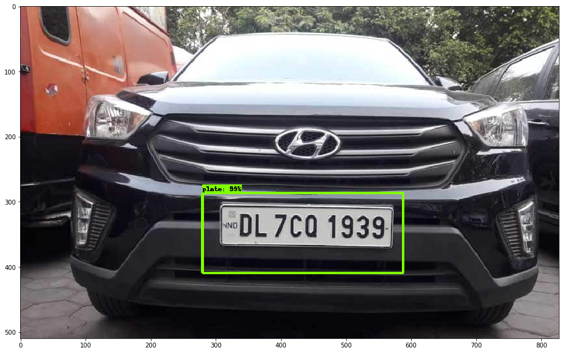
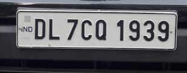
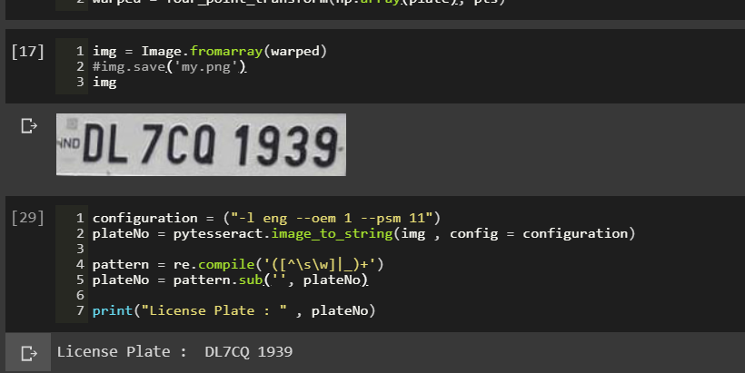

[Github Link](https://github.com/Kshitijpawar/License_Plate_Detection)


# License Plate Detection and OCR(Optical Character Recognition)
> Using Machine Learning and AI to detect and identify license plate number

## Table of contents
* [General info](#general-info)
* [Screenshots](#screenshots)
* [Technologies](#technologies)
* [Setup](#setup)
* [Contact](#contact)

## General info

By employing Tensorflow, Google Colab and Tesseract license plate number can be extracted from the input image in text string format.  
Object Detection API is used to extract the bounding box for license plate  

## Screenshots  

## Technologies
* Tensorflow(Object Detection API)
* Google Colab(Hardware purpose Tesla K80 GPU)
* Tesseract(OCR)

## Setup

* [License Plate Detection](https://colab.research.google.com/drive/1B-u6-uj5LFhqeCelBxuN-auImiHqKU_R)
* [License Plate Identification]( https://colab.research.google.com/drive/1DlpP0p9IWJkVd3bmsgSnI6KjUCbhIT8L)
* [Some more Examples to test](https://colab.research.google.com/github/Kshitijpawar/License_Plate_Detection/blob/master/Testing_the_model.ipynb)

## Contact
Created by [Kshitij Pawar](https://www.linkedin.com/in/kshitij-pawar-39a771185/) 